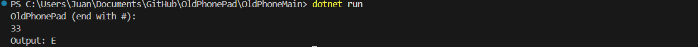
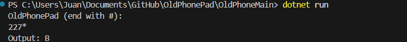
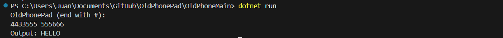
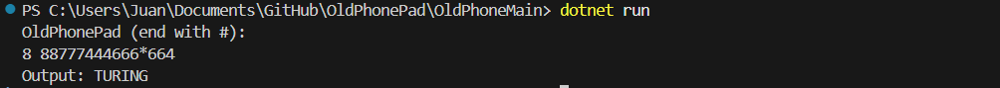
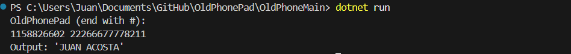

# Old Phone Pad Decoder

A C# console program that simulates typing on an old T9-style phone keypad to decode messages.

## Problem

You receive an input string of keypresses like `4433555 555666#` and you must decode it to the correct message, in this case: `HELLO`.

Special keys:
- `*` = backspace (removes last letter)
- `0` = space between letters
- ` ` = pause (to separate same-key characters)
- `#` = send (input ends here)

## Examples

| Input                | Output  |
|---------------------|---------|
| `33#`               | `E`     |

| `227*#`             | `B`     |

| `4433555 555666#`   | `HELLO` |

| `222 2 22#`         | `CAB`   |

| `1158826602 22266677778211#`         | `JUAN ACOSTA`   |



## How to Run
Open the Terminal in Visual Code
cd to OldPhoneMain and
```bash
dotnet run


